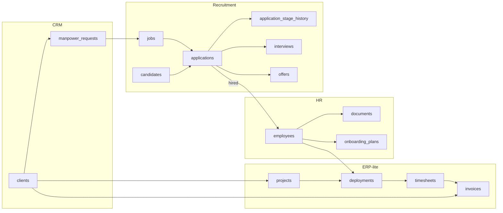
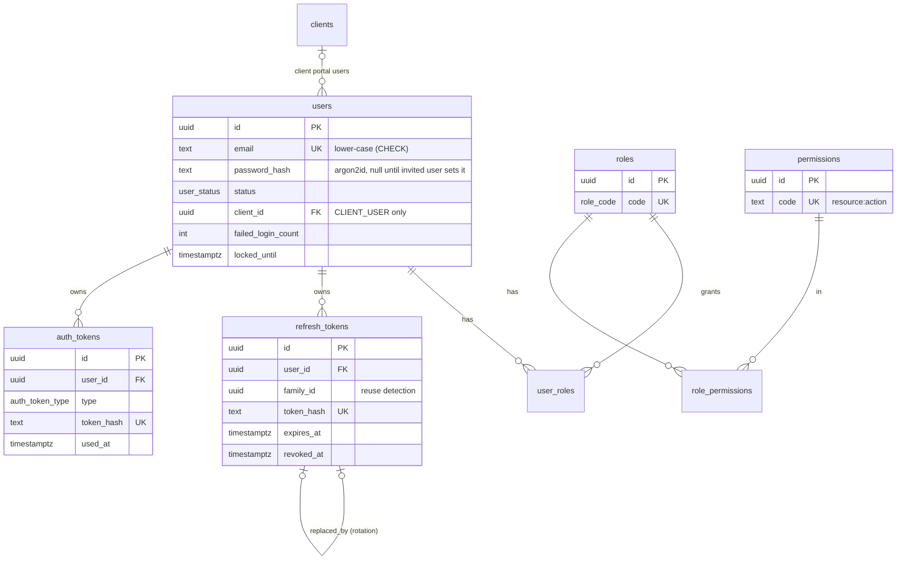
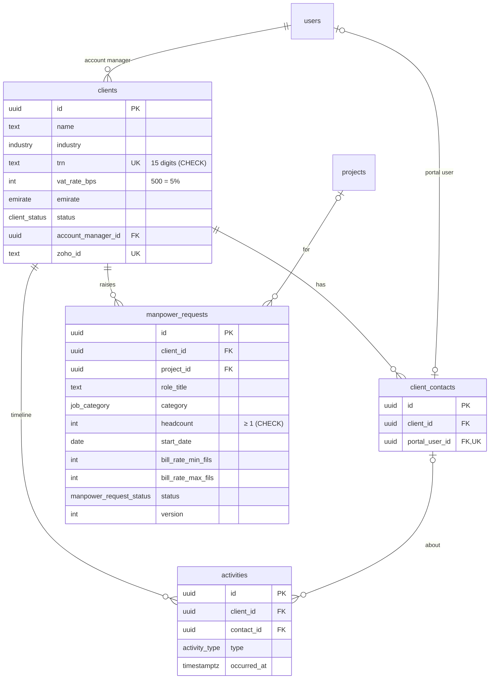
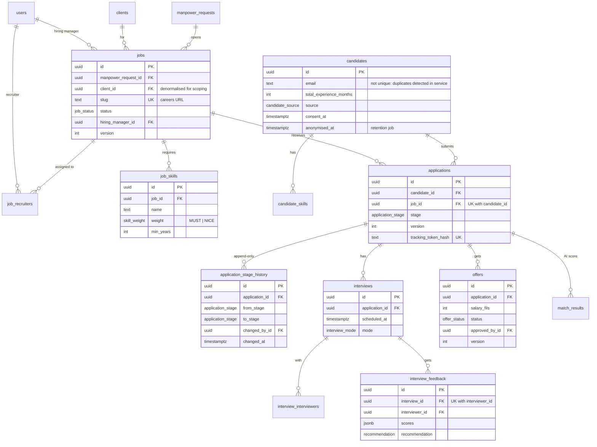
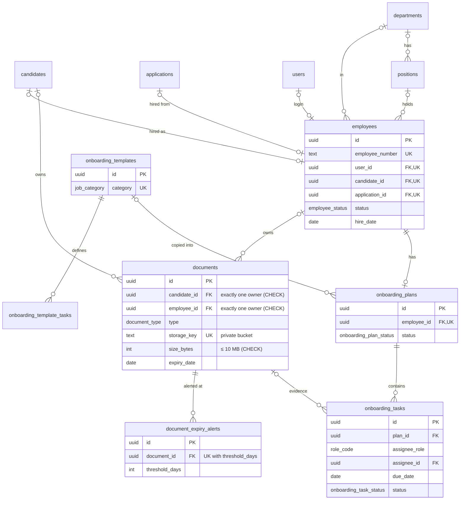
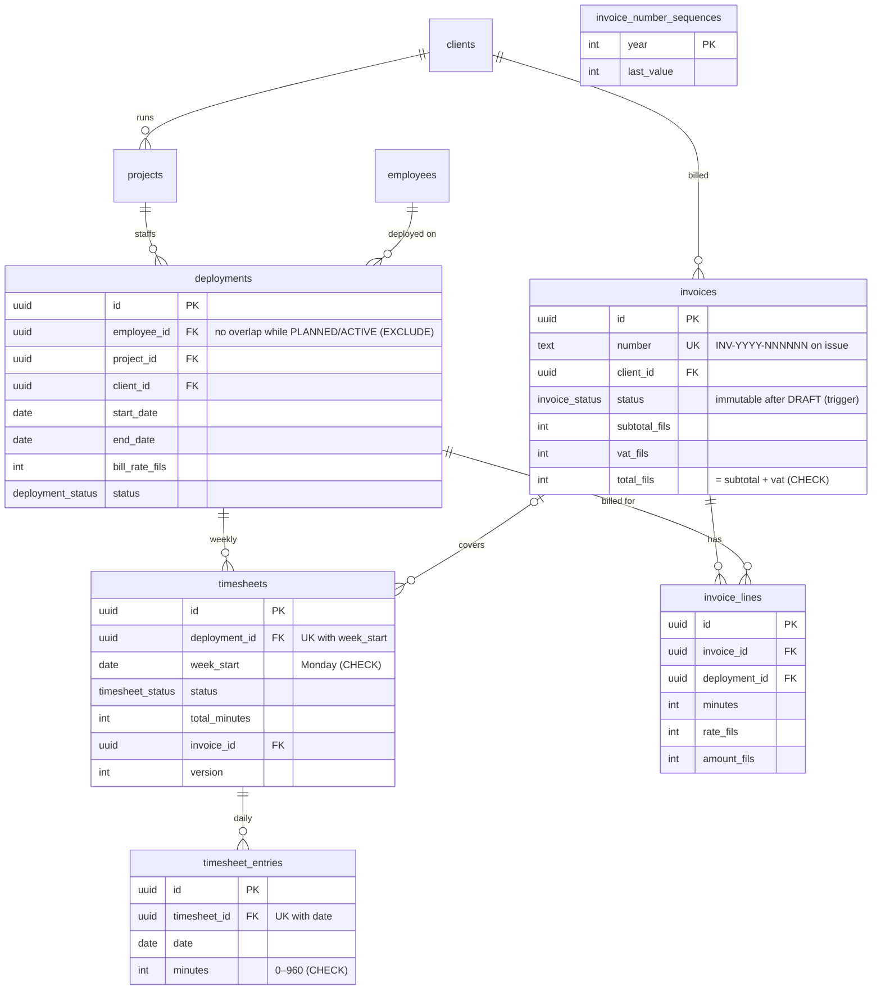
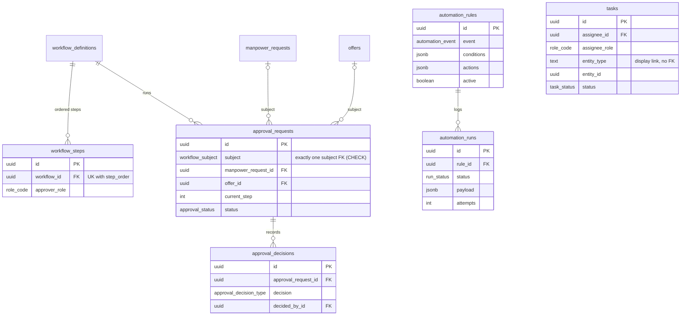
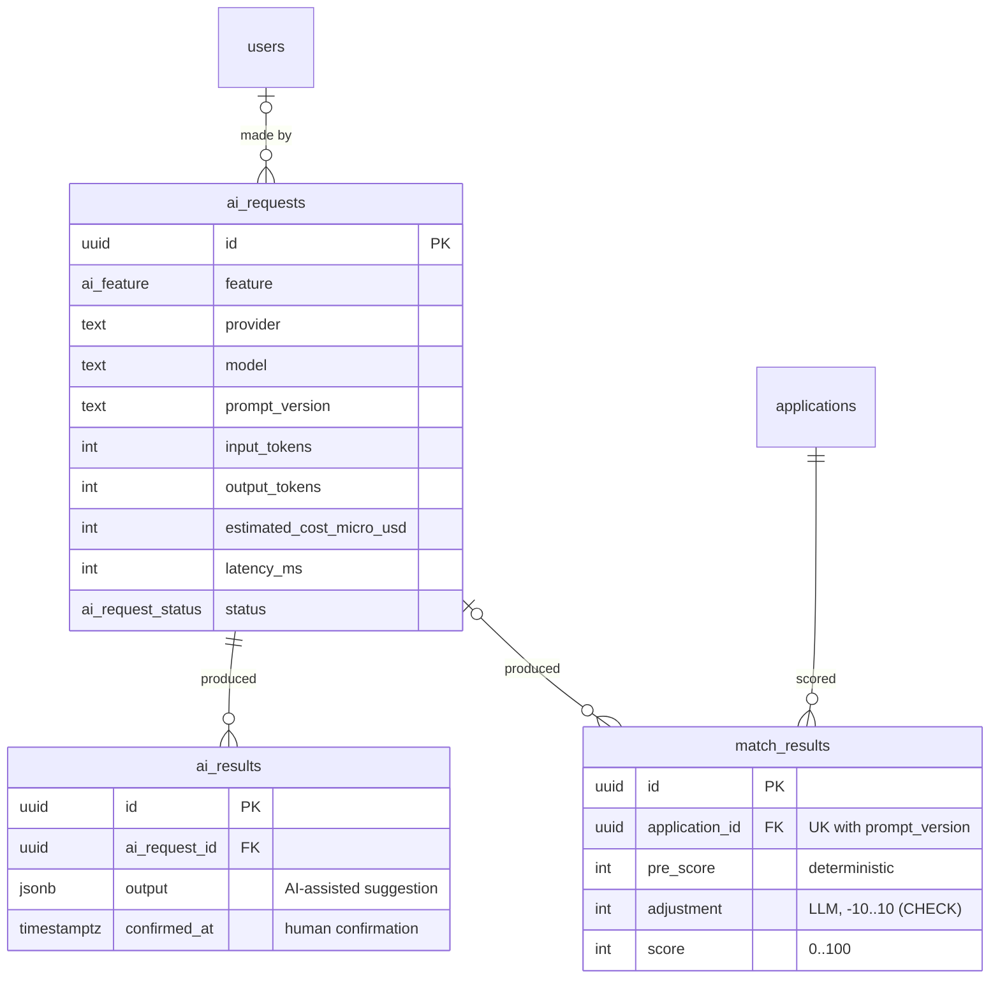
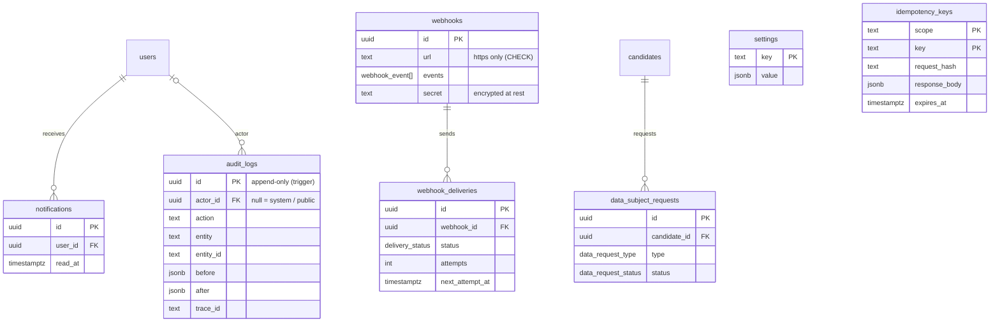

# StaffOS — Entity Relationship Diagram

Version 0.1 · 2026-10-07 · Source of truth: [`prisma/schema.prisma`](../prisma/schema.prisma)

The database has **55 tables in 9 areas**, PostgreSQL 18 on Neon. The diagrams below show keys and the columns that drive business rules; the full column list is in the schema. GitHub renders these Mermaid diagrams natively.

Conventions (CLAUDE.md §9):
- UUID v7 primary keys.
- `snake_case` tables and columns.
- `created_at` / `updated_at` / `created_by_id` on business tables; `deleted_at` soft delete on clients, contacts, jobs, candidates, employees, documents, automation rules and webhooks.
- Money as integer `*_fils` plus `currency` (default `AED`); durations as integer minutes.
- `version` for optimistic locking on records with state transitions.
- Every foreign key is indexed (asserted by a test).

## 1. Overview: the business flow across areas

## 2. Identity and access

## 3. CRM

## 4. Recruitment (ATS)

## 5. HR core and onboarding

## 6. Workforce / ERP-lite

## 7. Workflow engine and automation

## 8. AI

## 9. Platform

## 10. Rules enforced by the database (`*_integrity` migration)

| Rule | Mechanism |
| --- | --- |
| `audit_logs` and `application_stage_history` are append-only | `BEFORE UPDATE/DELETE/TRUNCATE` triggers |
| Issued invoices and their lines can't change; only lifecycle fields (status, paid_on, void_reason, PDF key) | Triggers on `invoices` and `invoice_lines` |
| One employee can't have overlapping planned/active deployments | `EXCLUDE USING gist` on employee + date range (`btree_gist`) |
| A document has exactly one owner; an approval has exactly one subject | `CHECK (num_nonnulls(...) = 1)` |
| Headcount ≥ 1, money ≥ 0, ranges ordered, VAT 0–100%, invoice total = subtotal + VAT | `CHECK` constraints |
| Timesheet weeks start on Monday; 0–16 h per day | `CHECK` constraints |
| Match score 0–100 with an AI adjustment of at most ±10 | `CHECK` constraint |
| Emails stored lower-case; webhook URLs are HTTPS | `CHECK` constraints |

All of these are covered by `apps/api/test/schema.db.spec.ts` against a real Postgres.

**Not yet in the database (planned):**
- The reporting views (`v_hiring_funnel`, `v_time_to_hire`, `v_client_revenue`, `v_open_requests`) and the read-only role are added with the reports module.
- pg-boss creates its own `pgboss` schema at runtime.
